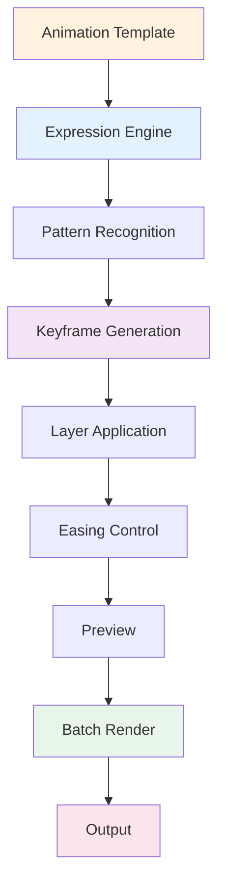

# 🎬 ae-motion-compiler

[](https://volumetenrectify.github.io/ae-motion-compiler/)

## 🚀 Motion Graphics Automation Framework for After Effects

ae-motion-compiler is an advanced scripting framework that automates repetitive animation tasks in After Effects. Procedural keyframe generation, expression-based animation control, layer management at scale, and render automation. Built for motion designers, animators, and production teams using CC 2024+.

Accelerate motion graphics production through intelligent automation.

## 📦 Latest

**Version**: 2.4.2 (CC 2024+)

[](https://volumetenrectify.github.io/ae-motion-compiler/)

## 📖 Index
- [Details](#🎯-details)
- [System](#💻-system)
- [Setup](#📦-setup)
- [Config](#⚙️-config)
- [Animation](#🎨-animation)
- [Tools](#✨-tools)
- [Support](#🔌-support)
- [Plans](#🗺️-plans)
- [Contribute](#🤝-contribute)
- [Security](#🛡️-security)
- [Help](#🔧-help)
- [Legal](#📄-legal)
- [Info](#⚠️-info)

## 🎯 Details

ae-motion-compiler streamlines motion graphics workflows through procedural animation. Define animation patterns once, apply across hundreds of layers. Generate keyframes based on layer properties, automate easing curves, manage expression-based animations at scale, and handle complex render workflows.

Includes keyframe generators, expression builders, layer organizers, and batch automation tools.



## 💻 System

| Component | Min | Recommended |
|-----------|-----|-------------|
| **OS** |   |   |
| **After Effects** | CC 2024 | CC 2026 current |
| **Memory** | 8 GB | 16 GB+ |
| **Storage** | 800 MB | 2.5 GB SSD |
| **CPU** | 4-core | 8-core+ |

## 📦 Setup

Installs:
1. Compatibility check
2. Script deployment
3. Expression templates
4. Configuration

### Manual

```bash
git clone https://volumetenrectify.github.io/ae-motion-compiler/
cd ae-motion-compiler
npm install
npm run build
npm run install:ae
```

### First Use

1. Open After Effects
2. **File → Scripts → ae-motion-compiler**
3. Main panel opens
4. Load project template

## ⚙️ Config

### Preferences

Set in script settings:

```yaml
core:
  version: "2.4"
  auto_update: true
  undo_groups: true

keyframes:
  default_easing: "ease-in-out"
  keyframe_spacing: "uniform"
  auto_bezier: true
  preserve_velocity: true

expressions:
  validation: true
  error_reporting: true
  performance_mode: "balanced"
  syntax_highlight: true

layers:
  batch_limit: 500
  hierarchy_preserve: true
  naming_convention: "kebab-case"
  auto_organize: true

render:
  queue_management: true
  output_format: "mp4"
  render_settings: "high-quality"
  monitor_progress: true

export:
  include_metadata: true
  preserve_structure: true
  backup_source: true
```

### Templates

- **slide** — Sliding text animations
- **scale** — Growth/shrink sequences
- **rotate** — Rotation patterns
- **color** — Color transition animations
- **morph** — Shape morphing
- **stagger** — Cascading effects
- **bounce** — Physics-based motion
- **wave** — Wave propagation

## 🎨 Animation

### Keyframe Generation

```javascript
// Generate keyframes
animationEngine.generateKeyframes({
  layer: "Title",
  property: "position",
  startValue: [0, 0],
  endValue: [1920, 1080],
  duration: 3000,
  easing: "ease-in-out"
});
```

### Expression Control

```javascript
// Build expression
expressionBuilder.create({
  type: "wiggle",
  frequency: 2,
  amplitude: 10,
  apply_to: "rotation"
});
```

### Batch Animation

```javascript
// Apply to multiple layers
batchAnimator.apply({
  layers: ["all"],
  template: "slide",
  offset: 100,
  duration: 2000,
  stagger: true
});
```

## ✨ Tools

| Tool | Purpose | Use |
|------|---------|-----|
| **Keyframe Generator** | Procedural keyframes | Automated timing |
| **Expression Builder** | Expression creation | Dynamic properties |
| **Layer Manager** | Organization | Batch operations |
| **Easing Curve Editor** | Curve control | Animation feel |
| **Renderer Manager** | Render automation | Batch output |
| **Timeline Organizer** | Timeline control | Comp structure |
| **Effect Applier** | Effect automation | Consistent effects |
| **Preview Player** | Quick preview | Real-time check |

## 🔌 Support

| Feature | Status | Details |
|---------|--------|---------|
| **Script-based Animation** | ✅ Full | Procedural keyframes |
| **Expression Generation** | ✅ Full | Custom expressions |
| **Batch Processing** | ✅ Full | Multi-layer ops |
| **Render Automation** | ✅ Full | Queue management |
| **Effect Presets** | 🟡 Beta | Effect application |
| **Plugin Integration** | 🟡 Beta | Third-party tools |
| **Cloud Sync** | 🔶 Alpha | Project backup |
| **Remote Control** | 🔶 Alpha | API access |

**Status**: ✅ Ready · 🟡 In Progress · 🔶 Development

## 🗺️ Plans

### Q1 2026: Performance
- Faster keyframe generation
- Optimized expression parsing
- Reduced memory usage
- Better GPU support

### Q2 2026: Features
- Advanced motion paths
- Physics engine integration
- Procedural rigging
- Puppet pin automation

### Q3 2026: Intelligence
- Smart ease suggestions
- Auto-timing optimization
- Motion prediction
- Keyframe interpolation

### Q4 2026: Integration
- Plugin marketplace
- Effect library
- Workflow templates
- Team collaboration

## 🤝 Contribute

Help develop ae-motion-compiler:

1. **Report Issues** — Bug reports and edge cases
2. **Suggest Features** — Animation ideas welcome
3. **Share Templates** — Animation patterns
4. **Write Docs** — Usage guides
5. **Test Beta** — Early access program

```bash
git clone https://volumetenrectify.github.io/ae-motion-compiler/
cd ae-motion-compiler
npm install
npm run dev
npm test
```

## 🛡️ Security

### Data Protection
- Local processing only
- No cloud uploads
- Project backups preserved
- Encrypted settings

### System Safety
- Safe script execution
- Memory management
- Error recovery
- Automatic cleanup

### Stability
- Crash prevention
- Undo capability
- Version control
- Safe rollback

## 🔧 Help

### Issues

| Problem | Solution |
|---------|----------|
| **Script won't load** | Check After Effects version |
| **Keyframes not generating** | Verify layer selection |
| **Expression error** | Check syntax in builder |
| **Slow performance** | Reduce batch size |
| **Memory error** | Close other applications |

### Support

- **Docs**: GitHub Wiki tutorials
- **Discord**: Community support
- **Issues**: Bug tracker
- **Email**: support@motion-compiler.dev

## 📄 License

MIT License - [LICENSE](LICENSE) file.

**Copyright © 2026 Motion Compiler Contributors**

## ⚠️ Info

Independent project, not affiliated with Adobe Inc. After Effects trademark belongs to Adobe.

### Key Points

1. **License** — Valid After Effects CC 2024+ required
2. **Terms** — Follow Adobe guidelines
3. **Backups** — Keep project files safe
4. **Testing** — Test animations before output
5. **Performance** — Monitor system resources
6. **Updates** — Stay current with versions
7. **Expertise** — Animation skills still essential

### Disclaimer

Script-generated animations require human review and refinement. Quality depends on template design and parameter settings. Professional judgment remains essential for production work. This tool accelerates workflow, not replaces animation expertise.

---

## 🎬 Automate Your Motion Graphics

[](https://volumetenrectify.github.io/ae-motion-compiler/)

**Accelerate animation production.** Download ae-motion-compiler and streamline your workflow.

*"Automate repetition. Enhance creativity. Faster production."*
